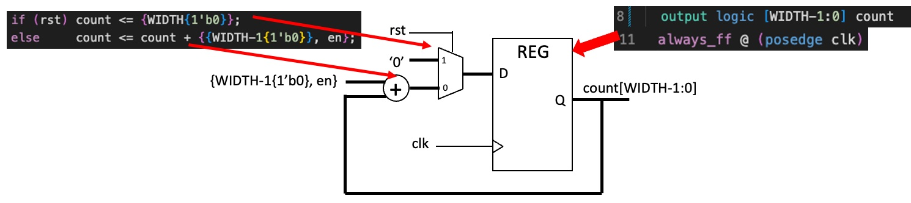
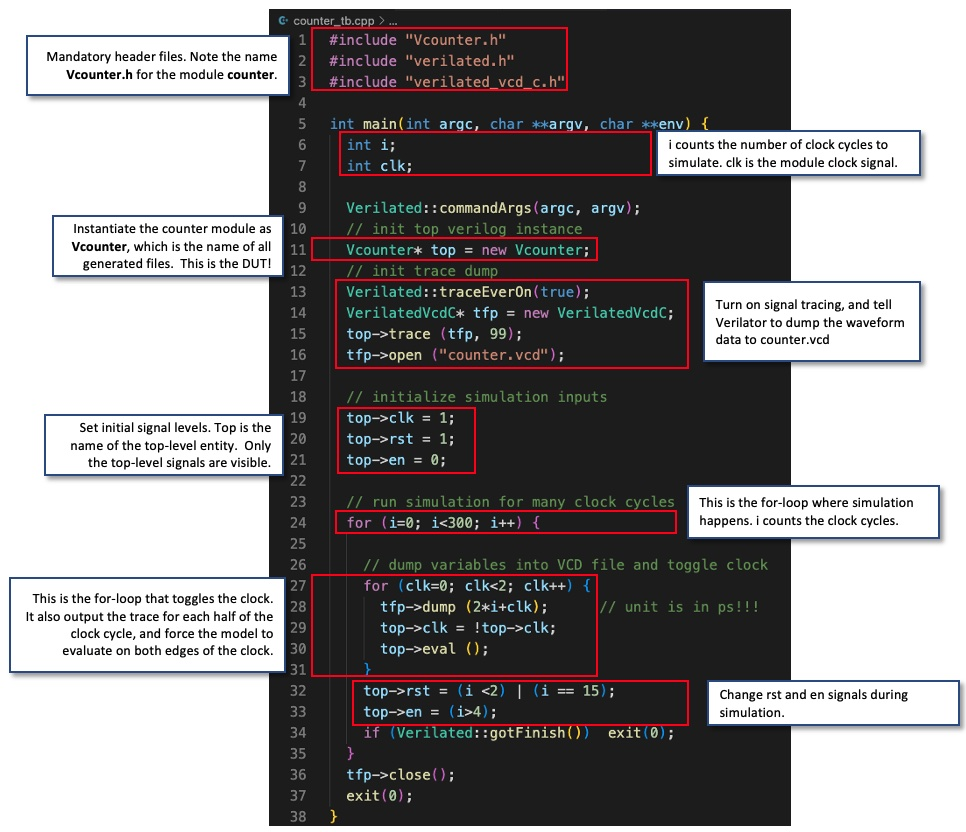
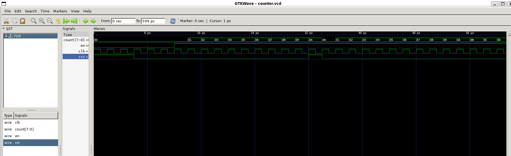
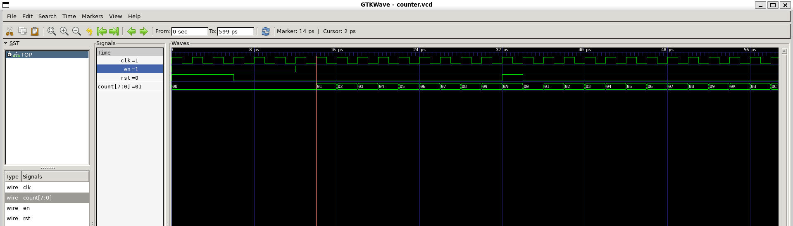
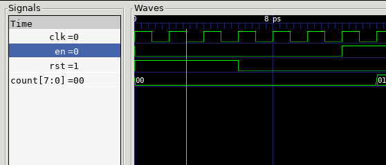

Create your design in this folder.

### Notes:

**Step 1-3**

- Using HDL/SystemVerilog extension to add font colouring
- The name of the module has to be the same as the name of the file in this case counter
- Set the individual inputs and outputs and specify the requirements

```SystemVerilog
always_ff @(posedge clk) :
Represents a flip-flop (ff), the process is triggered (executed) on every positive edge of the clock. This replaces always @(posedge clk).
```
**always_latch : is for representing latches**

An example on how to use it:
```SystemVerilog
always_latch begin
  if (enable) begin
     a_latch <= something;
  end
  //No else clause so a_latch's value
  //is not always defined, so it holds its value
end
```

otherwise you would write it like:
```SystemVerilog
always @* begin
  if (enable) begin
     a_latch = something;
  end
  //No else clause so a_latch's value
  //is not always defined, so it holds its value
end
```

always_comb:
is for combinatorial logic, it is replacement for always @* when you do not want a latch. Now we can differentiate our design intent between when we want and do not want latches.

The SystemVerilog names always_ff, always_latch and always_comb have stricter criteria for when they are triggered, this means the chance for RTL to Gate level (post synthesis) mismatch is reduced. It does mean they are not 100% equivalent to their always @ counterpart and may change some simulation behaviour.


- ‘<=’ in line 12 and 13 are non-block assignments which should be used within an always_ff block.

- {WIDTH{1’b0}} in line 12 uses the concatenation operator { } to form WIDTH bits of ‘0’. 

**Can you explain the construct in line 13?**

**Answer**
If the else is taken (in the case where reset is low) then the count output variable is taken and to its current value you add another 8 bit number. This is in

**1'b0**
This means take 1 b0 and. When combined with the concatenation operator **{}** you can set how many bit of b0 you create. so WIDTH{1'b0} creates WIDTH bits of 1x0s = 8 bits of 0. WIDTH{2'b0} would create 16 bits of 0.

**The non-blocking operator: <=**
- Non-blocking assignment allows assignments to be scheduled without blocking the execution of following statements and is specified by a <= symbo



**Step 4 - Writing the C++ Testbench**



**Step 5 - Compiling**


Run Verilator to translate Verilog into C++, including C++ testbench in the terminal:

**verilator -Wall --cc --trace counter.sv --exe counter_tb.cpp**

Then build C++ project via make automatically generated by Verilator

**make -j -C obj_dir/ -f Vcounter.mk Vcounter**

This makes Vcounter, which is the executable model of our counter!

We are now ready to simulate by simply running Vcounter, which is again in the obj_dir/. directory, by entering:

run executable simulation file

**obj_dir/Vcounter**
- Leaves us with a vsd Dump file in the higher directory and this can then be viewd using GTKWave

**Step 6**

Run gtkwave with the following command:

**gtkwave counter.vcd**




### Challenge Yourself

1. Modify the testbench so that you stop counting for 3 cycles once the counter reaches 0x9, and then resume counting. You may also need to change the stimulus for rst:

2. The current counter has a synchronous reset. To implement asynchronous reset, you can change line 11 of counter.sv to detect change in rst signal. (See notes.)


**EVIDENCE**

Showing Task 1 Working:

Only used GTKWave to visualise the output here:



- Here you can see that the reset is high for i < 2. This means that after three up/downs of top->clk (done in the for loop)
- i counts the num of clock cylces so i < 2 means after 3 clk cycles the reset will be low
s



- i = 0 and while in this loop for this i = 0, then the clk finishes one cycle. So i is always one behind the clock cycle