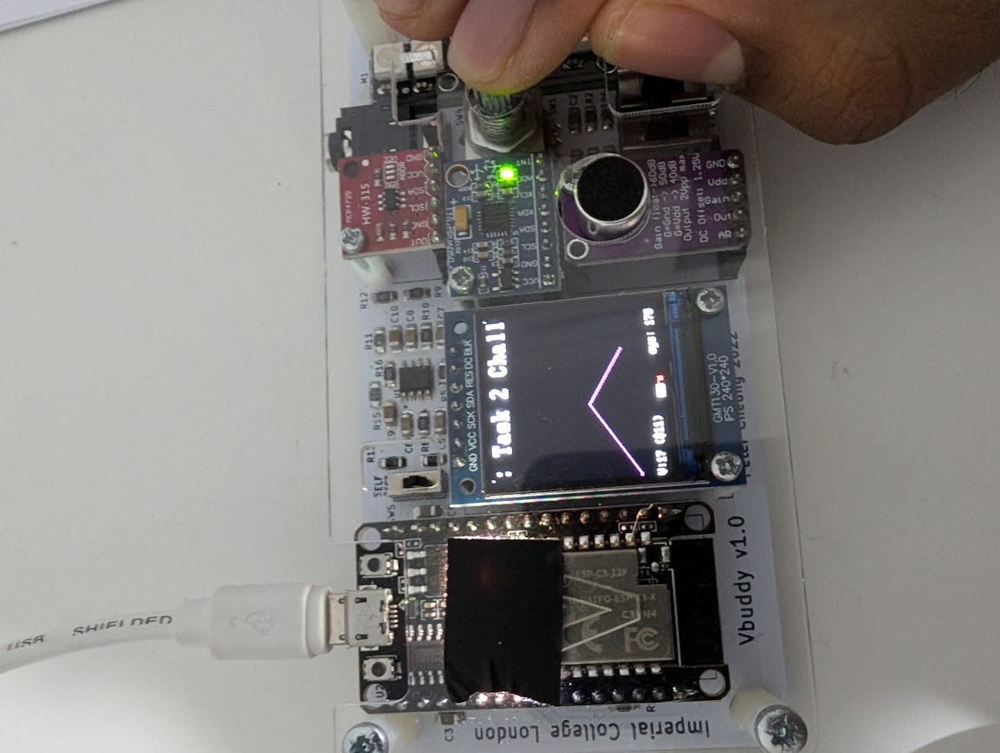
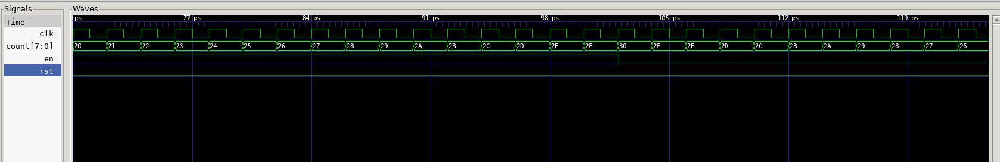
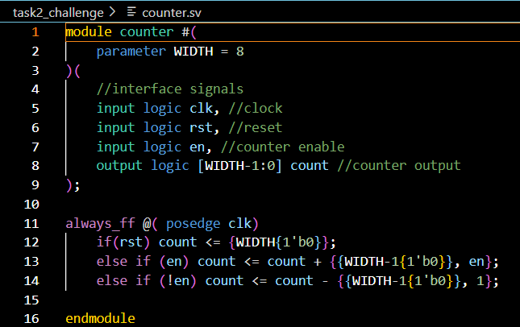

### VBuddy

**GTKWave Sim**

- Shows that when the enable was clicked to be low (using the vbuddy flag), the counter started counting down

**SV File**

- modified so that in the case where en is low we subtract one from the current count for every clock tick

