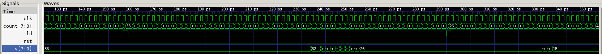
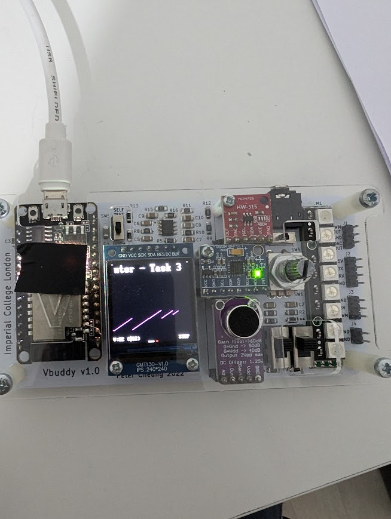

Vbuddy’s flag register has two modes of operation. The default mode is TOGGLE, which means that everything the rotary encoder switch is pressed, the flag will toggle as indicated at the bottom of the TFT screen.

However, using the vbdSetMode(1) function, you can set the mode to ONE-SHOT behaviour. Whenever the switch is pressed, the flag register is set to ‘1’ as before – now the flag is “ARMED” ready to fire. However, when the flag register is read, it immediate resets to ‘0’.

Modify counter.sv so that pressing the switch on EC11 forces the counter to pre-set to Vbuddy’s parameter value. (How?) Compile and test your design.

**GTKWave**

- shows v being changed from 33 to 26 and the load spike when the flag is clicked
- Shows when one shot mode is enabled the load goes back down in the next clock cycle when the register is read
- shows that the counter value updates to be 33 when the load was high in the first round

**Vbuddy**

